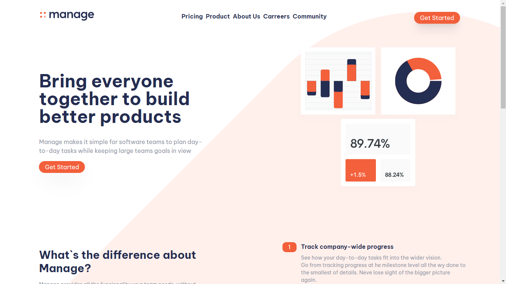

# Frontend Mentor - Manage landing page solution

This is a solution to the [Manage landing page challenge on Frontend Mentor](https://www.frontendmentor.io/challenges/manage-landing-page-SLXqC6P5). Frontend Mentor challenges help you improve your coding skills by building realistic projects.

## Table of contents

- [Overview](#overview)
  - [The challenge](#the-challenge)
  - [Screenshot](#screenshot)
  - [Links](#links)
- [My process](#my-process)
  - [Built with](#built-with)
  - [What I learned](#what-i-learned)
  - [Continued development](#continued-development)
  - [Useful resources](#useful-resources)
- [Author](#author)
- [Acknowledgments](#acknowledgments)

## Overview

### The challenge

Users should be able to:

- View the optimal layout for the site depending on their device's screen size
- See hover states for all interactive elements on the page
- See all testimonials in a horizontal slider
- Receive an error message when the newsletter sign up `form` is submitted if:
  - The `input` field is empty
  - The email address is not formatted correctly

### Screenshot

### Links

- Solution URL: [solution](https://www.frontendmentor.io/solutions/manage-landing-page-with-tailwind-N2e_Vx-In8)
- Live Site URL: [netlify site](https://manage-landing-page-rm0909.netlify.app/)

## My process

### Built with

- Semantic HTML5 markup
- Mobile-first workflow
- [Tailwind](https://tailwindcss.com/) - JS library
- [Vite](https://vitejs.dev/) - Vite

### What I learned

I learned to create a slider with javascript.

### Continued development

I plan to build more projects using vanilla javascript and improve myself more with css animations so I don't get too dependent on frameworks

### Useful resources

- [Webdev Simplified](https://www.youtube.com/watch?v=9HcxHDS2w1s) - This video helped me building the slider.

## Author

- Website - [Raphael Machado](https://rm0909portfolio.netlify.app/)
- Frontend Mentor - [@rm0909](https://www.frontendmentor.io/profile/rm0909)
